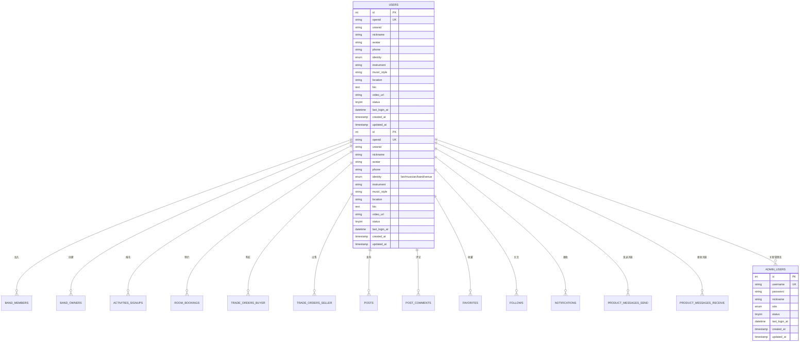
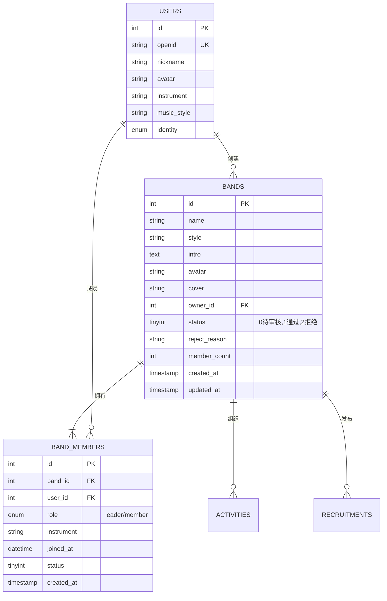
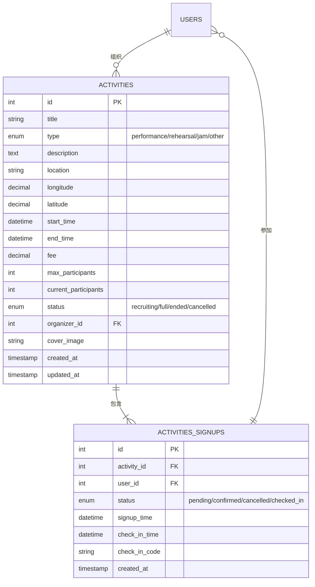
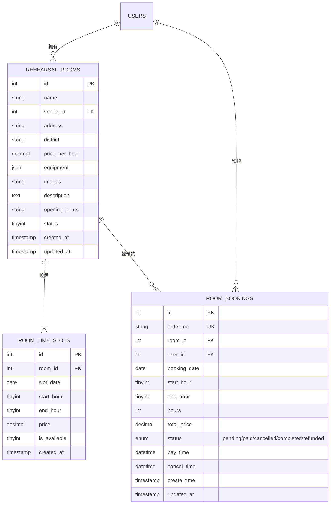
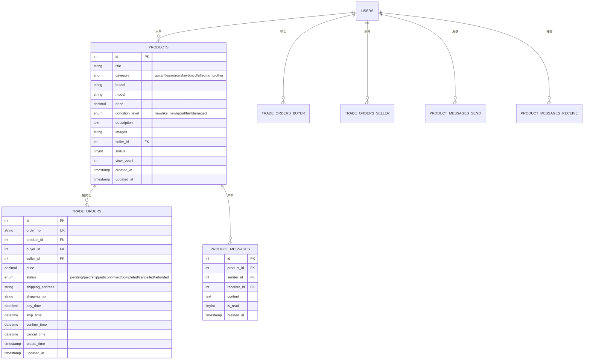
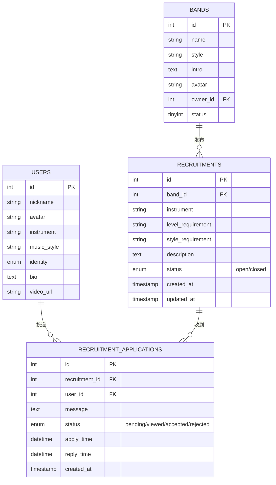
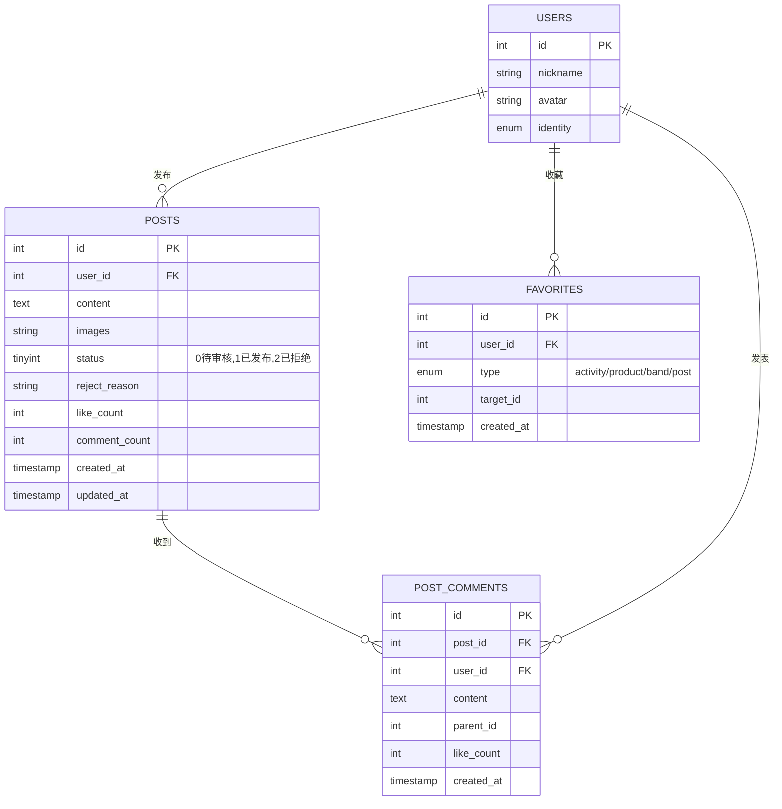
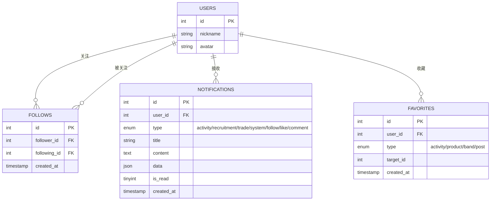
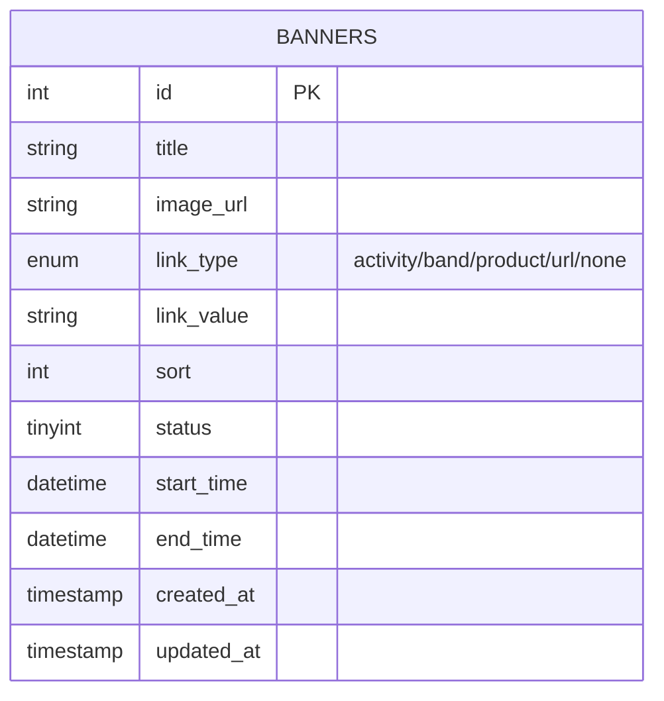
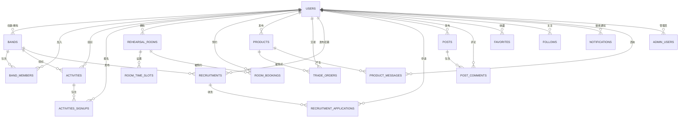

# Gojica 数据库 ER 图

## 📊 模块一：用户与认证模块

---

## 📊 模块二：乐队管理模块

---

## 📊 模块三：活动管理模块

---

## 📊 模块四：排练房预约模块

---

## 📊 模块五：二手设备交易模块

---

## 📊 模块六：乐手招募模块

---

## 📊 模块七：社区动态模块

---

## 📊 模块八：社交与通知模块

---

## 📊 模块九：首页配置模块

---

## 🔗 完整的 ER 关系总览

---

## 📋 表关系说明

### 核心关系

| 关系 | 说明 | 关系类型 |
|------|------|---------|
| users → bands | 用户创建乐队 | 1:N |
| users → band_members | 用户加入乐队 | N:M |
| users → activities | 用户组织活动 | 1:N |
| users → activities_signups | 用户报名活动 | N:M |
| users → rehearsal_rooms | 场地商家拥有排练房 | 1:N |
| users → room_bookings | 用户预约排练房 | 1:N |
| users → products | 用户发布商品 | 1:N |
| users → trade_orders | 用户参与交易 | N:M |
| users → posts | 用户发布动态 | 1:N |
| users → follows | 用户互相关注 | N:M |
| users → notifications | 用户接收通知 | 1:N |
| bands → recruitments | 乐队发布招募 | 1:N |
| users → recruitment_applications | 用户投递申请 | N:M |

### 特殊关系

| 关系 | 说明 |
|------|------|
| products → trade_orders (buyer) | 商品被购买 |
| products → trade_orders (seller) | 商品被出售 |
| products → product_messages (sender) | 用户发送咨询 |
| products → product_messages (receiver) | 用户接收咨询 |
| activities → activities_signups | 活动包含报名 |
| posts → post_comments | 动态包含评论 |
