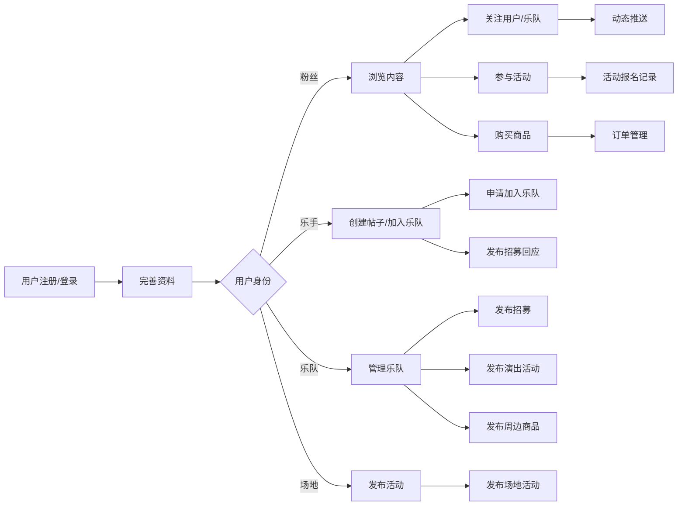

# Gojica 数据库设计文档

---

## 1. 文档信息

| 项目 | 内容 |
|------|------|
| 文档版本 | v1.0 |
| 创建日期 | 2026-04-29 |
| 数据库类型 | MySQL 8.0+ |
| 字符集 | utf8mb4 |
| 排序规则 | utf8mb4_unicode_ci |

---

## 2. 数据库概述

Gojica 是一个音乐社交平台，数据库设计遵循以下原则：

- **规范化设计**：采用第三范式(3NF)，减少数据冗余
- **扩展性**：支持业务增长和功能扩展
- **性能优化**：合理设计索引和表结构
- **安全性**：字段长度限制、数据类型约束

---

## 3. 实体关系图 (ERD)

```mermaid
erDiagram
    USERS ||--o{ BANDS : owns
    USERS ||--o{ POSTS : creates
    USERS ||--o{ COMMENTS : writes
    USERS ||--o{ ROOMS : creates
    USERS ||--o{ ACTIVITIES : organizes
    USERS ||--o{ PRODUCTS : sells
    USERS }o--o{ FOLLOWS : follows
    
    BANDS ||--o{ BAND_MEMBERS : has
    BANDS ||--o{ POSTS : posts
    BANDS ||--o{ ACTIVITIES : hosts
    BANDS ||--o{ PRODUCTS : sells
    BANDS ||--o{ RECRUITMENTS : posts
    BANDS ||--o{ ROOMS : creates
    
    POSTS ||--o{ COMMENTS : has
    
    ROOMS ||--o{ USERS : contains

    class USERS {
        INT id PK
        VARCHAR openid UK
        VARCHAR unionid
        VARCHAR nickname
        VARCHAR avatar
        VARCHAR phone
        ENUM identity
        VARCHAR instrument
        VARCHAR music_style
        VARCHAR location
        TEXT bio
        VARCHAR video_url
        TINYINT status
        DATETIME last_login_at
        DATETIME created_at
        DATETIME updated_at
    }

    class BANDS {
        INT id PK
        VARCHAR name
        VARCHAR style
        TEXT intro
        VARCHAR avatar
        VARCHAR cover
        INT owner_id FK
        TINYINT status
        VARCHAR reject_reason
        INT member_count
        DATETIME created_at
        DATETIME updated_at
    }

    class BAND_MEMBERS {
        INT id PK
        INT band_id FK
        INT user_id FK
        ENUM role
        VARCHAR instrument
        DATETIME joined_at
        TINYINT status
        DATETIME created_at
        DATETIME updated_at
    }

    class POSTS {
        INT id PK
        TEXT content
        TEXT images
        INT user_id FK
        INT band_id FK
        TINYINT status
        INT view_count
        INT like_count
        INT comment_count
        DATETIME created_at
        DATETIME updated_at
    }

    class COMMENTS {
        INT id PK
        INT post_id FK
        INT user_id FK
        TEXT content
        INT parent_id FK
        DATETIME created_at
        DATETIME updated_at
    }

    class ACTIVITIES {
        INT id PK
        VARCHAR title
        TEXT description
        VARCHAR cover
        ENUM type
        VARCHAR status
        DATE start_time
        DATE end_time
        VARCHAR location
        INT organizer_id FK
        INT band_id FK
        INT max_participants
        INT current_participants
        DATETIME created_at
        DATETIME updated_at
        DATETIME deleted_at
    }

    class PRODUCTS {
        INT id PK
        VARCHAR title
        TEXT description
        VARCHAR cover
        DECIMAL price
        DECIMAL original_price
        ENUM type
        VARCHAR category
        TINYINT status
        INT stock
        INT sales_count
        INT seller_id FK
        INT band_id FK
        DATETIME created_at
        DATETIME updated_at
        DATETIME deleted_at
    }

    class RECRUITMENTS {
        INT id PK
        INT band_id FK
        VARCHAR title
        TEXT description
        VARCHAR instrument
        TEXT requirement
        VARCHAR contact
        TINYINT status
        DATETIME created_at
        DATETIME updated_at
    }

    class ROOMS {
        INT id PK
        VARCHAR name
        ENUM type
        TEXT description
        VARCHAR cover
        INT creator_id FK
        INT band_id FK
        INT max_users
        INT current_users
        TINYINT status
        DATETIME created_at
        DATETIME updated_at
    }

    class FOLLOWS {
        INT id PK
        INT follower_id FK
        INT following_id FK
        DATETIME created_at
    }

    class BANNERS {
        INT id PK
        VARCHAR title
        VARCHAR image_url
        ENUM link_type
        VARCHAR link_value
        INT sort
        TINYINT status
        DATETIME start_time
        DATETIME end_time
        DATETIME created_at
        DATETIME updated_at
    }
```

---

## 4. 表结构详细说明

### 4.1 用户表 (users)

| 字段名 | 类型 | 约束 | 说明 |
|--------|------|------|------|
| id | INT | PRIMARY KEY, AUTO_INCREMENT | 用户唯一标识 |
| openid | VARCHAR(100) | NOT NULL, UNIQUE | 微信OpenID |
| unionid | VARCHAR(100) | NULL | 微信UnionID |
| nickname | VARCHAR(100) | NULL | 用户昵称 |
| avatar | VARCHAR(500) | DEFAULT '/static/images/default-avatar.png' | 头像URL |
| phone | VARCHAR(20) | NULL | 手机号 |
| identity | ENUM('fan','musician','band','venue') | DEFAULT 'fan' | 用户身份 |
| instrument | VARCHAR(100) | NULL | 擅长乐器 |
| music_style | VARCHAR(200) | NULL | 音乐风格偏好 |
| location | VARCHAR(100) | NULL | 所在地 |
| bio | TEXT | NULL | 个人简介 |
| video_url | VARCHAR(500) | NULL | 视频链接 |
| status | TINYINT | DEFAULT 1 | 状态：0禁用，1正常 |
| last_login_at | DATETIME | NULL | 最后登录时间 |
| created_at | TIMESTAMP | DEFAULT CURRENT_TIMESTAMP | 创建时间 |
| updated_at | TIMESTAMP | ON UPDATE CURRENT_TIMESTAMP | 更新时间 |

**索引设计**：
- `idx_openid` (openid)
- `idx_identity` (identity)
- `idx_location` (location)

---

### 4.2 乐队表 (bands)

| 字段名 | 类型 | 约束 | 说明 |
|--------|------|------|------|
| id | INT | PRIMARY KEY, AUTO_INCREMENT | 乐队唯一标识 |
| name | VARCHAR(100) | NOT NULL | 乐队名称 |
| style | VARCHAR(100) | NULL | 音乐风格 |
| intro | TEXT | NULL | 乐队介绍 |
| avatar | VARCHAR(500) | DEFAULT '/static/images/default-band.png' | 乐队头像 |
| cover | VARCHAR(500) | NULL | 封面图 |
| owner_id | INT | NOT NULL, FK(users.id) | 创建者ID |
| status | TINYINT | DEFAULT 0 | 状态：0待审核，1通过，2拒绝 |
| reject_reason | VARCHAR(500) | NULL | 拒绝原因 |
| member_count | INT | DEFAULT 0 | 成员数量 |
| created_at | TIMESTAMP | DEFAULT CURRENT_TIMESTAMP | 创建时间 |
| updated_at | TIMESTAMP | ON UPDATE CURRENT_TIMESTAMP | 更新时间 |

**索引设计**：
- `idx_name` (name)
- `idx_style` (style)
- `idx_status` (status)

---

### 4.3 乐队成员表 (band_members)

| 字段名 | 类型 | 约束 | 说明 |
|--------|------|------|------|
| id | INT | PRIMARY KEY, AUTO_INCREMENT | 记录唯一标识 |
| band_id | INT | NOT NULL, FK(bands.id) | 乐队ID |
| user_id | INT | NOT NULL, FK(users.id) | 用户ID |
| role | ENUM('leader','member') | DEFAULT 'member' | 角色 |
| instrument | VARCHAR(50) | NULL | 演奏乐器 |
| joined_at | DATETIME | DEFAULT CURRENT_TIMESTAMP | 加入时间 |
| status | TINYINT | DEFAULT 1 | 状态：0待审核，1已加入 |
| created_at | TIMESTAMP | DEFAULT CURRENT_TIMESTAMP | 创建时间 |
| updated_at | TIMESTAMP | ON UPDATE CURRENT_TIMESTAMP | 更新时间 |

**索引设计**：
- `uk_band_user` (band_id, user_id) UNIQUE

---

### 4.4 帖子表 (posts)

| 字段名 | 类型 | 约束 | 说明 |
|--------|------|------|------|
| id | INT | PRIMARY KEY, AUTO_INCREMENT | 帖子唯一标识 |
| content | TEXT | NOT NULL | 帖子内容 |
| images | TEXT | NULL | 图片列表(JSON) |
| user_id | INT | NOT NULL, FK(users.id) | 用户ID |
| band_id | INT | NULL, FK(bands.id) | 乐队ID |
| status | TINYINT | DEFAULT 1 | 状态：0禁用，1正常 |
| view_count | INT | DEFAULT 0 | 浏览数 |
| like_count | INT | DEFAULT 0 | 点赞数 |
| comment_count | INT | DEFAULT 0 | 评论数 |
| created_at | DATETIME | DEFAULT CURRENT_TIMESTAMP | 创建时间 |
| updated_at | DATETIME | ON UPDATE CURRENT_TIMESTAMP | 更新时间 |

**索引设计**：
- `idx_user_id` (user_id)
- `idx_band_id` (band_id)
- `idx_status` (status)
- `idx_created_at` (created_at)

---

### 4.5 评论表 (comments)

| 字段名 | 类型 | 约束 | 说明 |
|--------|------|------|------|
| id | INT | PRIMARY KEY, AUTO_INCREMENT | 评论唯一标识 |
| post_id | INT | NOT NULL, FK(posts.id) | 帖子ID |
| user_id | INT | NOT NULL, FK(users.id) | 用户ID |
| content | TEXT | NOT NULL | 评论内容 |
| parent_id | INT | NULL, FK(comments.id) | 父评论ID |
| created_at | DATETIME | DEFAULT CURRENT_TIMESTAMP | 创建时间 |
| updated_at | DATETIME | ON UPDATE CURRENT_TIMESTAMP | 更新时间 |

**索引设计**：
- `idx_post_id` (post_id)
- `idx_user_id` (user_id)
- `idx_parent_id` (parent_id)

---

### 4.6 活动表 (activities)

| 字段名 | 类型 | 约束 | 说明 |
|--------|------|------|------|
| id | INT | PRIMARY KEY, AUTO_INCREMENT | 活动唯一标识 |
| title | VARCHAR(200) | NOT NULL | 活动标题 |
| description | TEXT | NULL | 活动描述 |
| cover | VARCHAR(255) | NULL | 活动封面 |
| type | ENUM('recruitment','performance','competition','other') | DEFAULT 'recruitment' | 活动类型 |
| status | VARCHAR(20) | DEFAULT 'recruiting' | 状态：recruiting/in_progress/ended |
| start_time | DATE | NULL | 开始时间 |
| end_time | DATE | NULL | 结束时间 |
| location | VARCHAR(200) | NULL | 活动地点 |
| organizer_id | INT | NULL, FK(users.id) | 组织者ID |
| band_id | INT | NULL, FK(bands.id) | 乐队ID |
| max_participants | INT | NULL | 最大参与人数 |
| current_participants | INT | DEFAULT 0 | 当前参与人数 |
| created_at | DATETIME | DEFAULT CURRENT_TIMESTAMP | 创建时间 |
| updated_at | DATETIME | ON UPDATE CURRENT_TIMESTAMP | 更新时间 |
| deleted_at | DATETIME | NULL | 软删除时间 |

**索引设计**：
- `idx_status` (status)
- `idx_type` (type)
- `idx_organizer_id` (organizer_id)
- `idx_band_id` (band_id)

---

### 4.7 商品表 (products)

| 字段名 | 类型 | 约束 | 说明 |
|--------|------|------|------|
| id | INT | PRIMARY KEY, AUTO_INCREMENT | 商品唯一标识 |
| title | VARCHAR(200) | NOT NULL | 商品名称 |
| description | TEXT | NULL | 商品描述 |
| cover | VARCHAR(255) | NULL | 商品封面 |
| price | DECIMAL(10,2) | NULL | 售价 |
| original_price | DECIMAL(10,2) | NULL | 原价 |
| type | ENUM('equipment','album','ticket','merchandise','other') | DEFAULT 'equipment' | 商品类型 |
| category | VARCHAR(50) | NULL | 分类 |
| status | TINYINT | DEFAULT 1 | 状态：0下架，1上架 |
| stock | INT | DEFAULT 0 | 库存 |
| sales_count | INT | DEFAULT 0 | 销量 |
| seller_id | INT | NULL, FK(users.id) | 卖家ID |
| band_id | INT | NULL, FK(bands.id) | 乐队ID |
| created_at | DATETIME | DEFAULT CURRENT_TIMESTAMP | 创建时间 |
| updated_at | DATETIME | ON UPDATE CURRENT_TIMESTAMP | 更新时间 |
| deleted_at | DATETIME | NULL | 软删除时间 |

**索引设计**：
- `idx_status` (status)
- `idx_type` (type)
- `idx_seller_id` (seller_id)
- `idx_band_id` (band_id)

---

### 4.8 招募表 (recruitments)

| 字段名 | 类型 | 约束 | 说明 |
|--------|------|------|------|
| id | INT | PRIMARY KEY, AUTO_INCREMENT | 招募唯一标识 |
| band_id | INT | NOT NULL, FK(bands.id) | 乐队ID |
| title | VARCHAR(200) | NOT NULL | 招募标题 |
| description | TEXT | NULL | 招募描述 |
| instrument | VARCHAR(50) | NOT NULL | 招募乐器/职位 |
| requirement | TEXT | NULL | 招募要求 |
| contact | VARCHAR(200) | NULL | 联系方式 |
| status | TINYINT | DEFAULT 1 | 状态：0关闭，1开放 |
| created_at | DATETIME | DEFAULT CURRENT_TIMESTAMP | 创建时间 |
| updated_at | DATETIME | ON UPDATE CURRENT_TIMESTAMP | 更新时间 |

**索引设计**：
- `idx_band_id` (band_id)
- `idx_status` (status)
- `idx_instrument` (instrument)

---

### 4.9 房间表 (rooms)

| 字段名 | 类型 | 约束 | 说明 |
|--------|------|------|------|
| id | INT | PRIMARY KEY, AUTO_INCREMENT | 房间唯一标识 |
| name | VARCHAR(100) | NOT NULL | 房间名称 |
| type | ENUM('chat','voice','video') | DEFAULT 'chat' | 房间类型 |
| description | TEXT | NULL | 房间描述 |
| cover | VARCHAR(255) | NULL | 房间封面 |
| creator_id | INT | NOT NULL, FK(users.id) | 创建者ID |
| band_id | INT | NULL, FK(bands.id) | 乐队ID |
| max_users | INT | DEFAULT 50 | 最大用户数 |
| current_users | INT | DEFAULT 0 | 当前用户数 |
| status | TINYINT | DEFAULT 1 | 状态：0关闭，1开放 |
| created_at | DATETIME | DEFAULT CURRENT_TIMESTAMP | 创建时间 |
| updated_at | DATETIME | ON UPDATE CURRENT_TIMESTAMP | 更新时间 |

**索引设计**：
- `idx_creator_id` (creator_id)
- `idx_band_id` (band_id)
- `idx_status` (status)
- `idx_type` (type)

---

### 4.10 关注表 (follows)

| 字段名 | 类型 | 约束 | 说明 |
|--------|------|------|------|
| id | INT | PRIMARY KEY, AUTO_INCREMENT | 记录唯一标识 |
| follower_id | INT | NOT NULL, FK(users.id) | 关注者ID |
| following_id | INT | NOT NULL, FK(users.id) | 被关注者ID |
| created_at | DATETIME | DEFAULT CURRENT_TIMESTAMP | 关注时间 |

**索引设计**：
- `uk_follower_following` (follower_id, following_id) UNIQUE

---

### 4.11 轮播图表 (banners)

| 字段名 | 类型 | 约束 | 说明 |
|--------|------|------|------|
| id | INT | PRIMARY KEY, AUTO_INCREMENT | 轮播图唯一标识 |
| title | VARCHAR(200) | NULL | 标题 |
| image_url | VARCHAR(500) | NOT NULL | 图片地址 |
| link_type | ENUM('activity','band','product','url','none') | DEFAULT 'none' | 链接类型 |
| link_value | VARCHAR(500) | NULL | 链接目标 |
| sort | INT | DEFAULT 0 | 排序序号 |
| status | TINYINT | DEFAULT 1 | 状态：0禁用，1启用 |
| start_time | DATETIME | NULL | 展示开始时间 |
| end_time | DATETIME | NULL | 展示结束时间 |
| created_at | DATETIME | DEFAULT CURRENT_TIMESTAMP | 创建时间 |
| updated_at | DATETIME | ON UPDATE CURRENT_TIMESTAMP | 更新时间 |

**索引设计**：
- `idx_sort` (sort)
- `idx_status` (status)

---

## 5. 表关系汇总

### 5.1 主外键关系

| 子表 | 外键 | 主表 | 主键 | 关系类型 |
|------|------|------|------|----------|
| bands | owner_id | users | id | 1:N |
| band_members | band_id | bands | id | 1:N |
| band_members | user_id | users | id | 1:N |
| posts | user_id | users | id | 1:N |
| posts | band_id | bands | id | 1:N |
| comments | post_id | posts | id | 1:N |
| comments | user_id | users | id | 1:N |
| comments | parent_id | comments | id | 1:N (自引用) |
| activities | organizer_id | users | id | 1:N |
| activities | band_id | bands | id | 1:N |
| products | seller_id | users | id | 1:N |
| products | band_id | bands | id | 1:N |
| recruitments | band_id | bands | id | 1:N |
| rooms | creator_id | users | id | 1:N |
| rooms | band_id | bands | id | 1:N |
| follows | follower_id | users | id | 1:N |
| follows | following_id | users | id | 1:N |

### 5.2 多对多关系

| 关系描述 | 中间表 | 左表 | 右表 |
|----------|--------|------|------|
| 用户关注用户 | follows | users (follower) | users (following) |

---

## 6. 业务数据流向



---

## 7. 数据安全与合规

### 7.1 敏感数据保护

| 字段 | 保护措施 |
|------|----------|
| phone | 脱敏存储，API返回时脱敏显示 |
| openid/unionid | 加密存储，不对外暴露 |

### 7.2 数据生命周期

- **用户数据**：用户注销后保留30天，然后匿名化处理
- **活动数据**：活动结束后保留1年归档
- **帖子/评论**：支持软删除，保留30天可恢复

---

## 8. 性能优化建议

1. **索引优化**：根据查询模式动态调整索引
2. **分表策略**：posts表达到100万条时考虑按时间分表
3. **缓存策略**：热门帖子、乐队信息使用Redis缓存
4. **读写分离**：主库写，从库读

---

**文档结束**